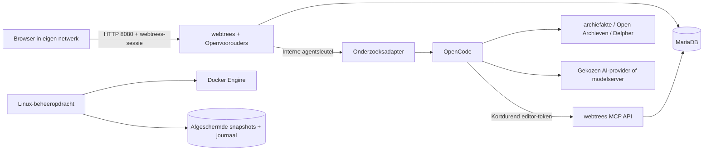

# Architectuur

De host beheert containers, releases, back-ups en herstel. Webtrees beheert identiteit, stamboom en menselijke goedkeuring. De agent beheert één onderzoeksopdracht tegelijk en bewaart dossiers en gesprekken.

## Vertrouwensgrenzen

- Onderzoekspagina's zijn webtrees-moduleacties. Iedere GET/POST controleert de ingestelde eigenaar en administratorrechten; POST gebruikt de bestaande CSRF-middleware.
- De actieve boom wordt server-side gekozen. Browserinvoer bepaalt nooit het API-token of de technische gebruiker.
- Een bestaande enige stamboom wordt hergebruikt wanneer de modulekeuze ontbreekt. De familiestart kan alleen een boom aanmaken wanneer er nog geen bestaat. De actieve boom is ook de standaardboom van webtrees; onderzoekspagina's en menu's gebruiken expliciet dezelfde boom in hun URL.
- De agent luistert uitsluitend op een intern Docker-netwerk. Alle aanvragen vereisen de interne sleutel, behalve loopbackprobes voor hostcontroles. Er is geen openbare agentpoort of Docker-socket.
- De technische gebruiker heeft alleen editorrechten op de actieve boom en geen automatische acceptatie of administratorrechten. De scope is standaard `mcp_read_privacy`; `mcp_read_member` wordt pas na toestemming voor precies de gekozen provider aangemaakt. Wijzigingen blijven voorstellen.
- Openbare en privé-opdrachten gebruiken verschillende werkmappen. De agent mag dossiers bewerken, maar geen OpenCode-configuratie, andere werkmappen of hostbestanden. De algemene shell en niet-toegestane tools zijn geweigerd.
- De installatiebeheerder en aanvullende PHP-modules zijn vertrouwd. Een bewust geïnstalleerde aanvullende PHP-module deelt de webtrees-processrechten; dit is geen sandbox voor kwaadwillende plugins.
- Alleen het webtrees-image gebruikt de vaste interne HTTP-uitzondering `http://webtrees/mcp` in de bridge. Andere HTTP-MCP-endpoints blijven geweigerd.

## Blijvende toestand

Onder `/opt/openvoorouders`:

| Pad | Inhoud |
|---|---|
| `data/database` | MariaDB-bestanden |
| `data/webtrees` | Configuratie, media en webtrees-gegevens |
| `data/modules` | Aanvullende modules en beschermde verwijzingen naar beheerde imagecode |
| `data/research/public`, `private` | Afzonderlijke dossiers en scans |
| `data/research/jobs.sqlite` | Opdrachten, toestemmingen en sessiekoppelingen |
| `data/opencode` | Native gesprekken en authenticatieopslag |
| `data/agent-config` | Providerconfiguratie, eigen endpoints |
| `secrets` | Database- en interne sleutels, bootstrap-accountinvoer |
| `host` | Vastgezette Nederlandse beheeropdracht en Compose-definitie |
| `control` | Onderhoudsvlag en catalogus van stabiele releases |
| `backups` | Complete lokale herstelarchieven, alleen root |
| `journals` | Duurzaam transactiejournaal per update/back-up |

Beheerde modules staan in het image onder `/opt/managed-modules`. De modulemap heeft een root-owned sticky directory en root-owned verwijzingen. Daardoor kan het PHP-proces een gebundelde module niet vervangen of verwijderen; CMM blijft aanvullende modules beheren. Een onverwachte fysieke map op een beheerde naam blokkeert het starten. De CMM-upgradehandler geeft voor beheerde modules een Nederlandse weigering.

## Update en herstel

1. Valideer stabiel manifest en upgradepad, vereisten, vrije ruimte, lokale Compose-wijzigingen en aanvullende modules.
2. Haal alle images op met digest, controleer het hostpakket met SHA-256 en controleer vrije ruimte opnieuw.
3. Schrijf het journaal, activeer onderhoud en controleer opnieuw of onderzoek loopt.
4. Stop alle containers en maak een cold snapshot van alle blijvende toestand, inclusief hostcode, configuratie en geheimen. Imagecode wordt niet in het gegevensarchief opgenomen.
5. Vervang hostcode en Compose, kies de nieuwe images en start. Webtrees/MariaDB voeren hun eigen migraties uit.
6. Controleer rendering, modulebestanden, database, echte webtrees-login en OpenCode-health; hef pas daarna onderhoud op.

Een onderbroken transactie blijft herkenbaar. Vóór mogelijke migratie kan `annuleer` de oude combinatie starten. Vanaf de migratiefase is volledig herstel verplicht. Herstel controleert de archiefchecksum en veilige bestandspaden, bewaart de mislukte toestand, zet alle gegevens en oude hostcode terug met oorspronkelijke rechten en controleert opnieuw. Ook een onderbreking tijdens bestandsvervanging kan opnieuw worden hersteld.

De huidige healthcheck bewijst nog niet de volledige werking van alle MCP-tools of ieder provider-OAuth-pad. Die integratiecontroles zijn expliciete voorwaarden voor stabiele vrijgave, zie acceptatie.md.

## Releasebeheer

Het kandidaatmanifest bevat gecontroleerde bronarchieven, npm-integriteit, image-digests, Composer-/uv-versies en de vastgezette Nederlandse werkwijze. Runtime haalt nooit `latest` of een bewegende bronbranch op. Bouwscripts mogen bij het maken van een voorstel nieuwe versies oplossen; de uitkomst wordt opnieuw vastgezet.

De componentgroepen bepalen welke images opnieuw gebouwd moeten worden. Een wijziging in archiefakte/Delpher raakt alleen de agent; een pluginwijziging alleen webtrees. PHP en de webtrees-applicatie zijn afzonderlijk vastgezette buildinputs. Iedere vrijgave levert een compleet nieuw manifest op. Upstreammigraties worden per release beschreven; ondersteuning van een upgradepad wordt nooit afgeleid uit alleen een hoger versienummer.
